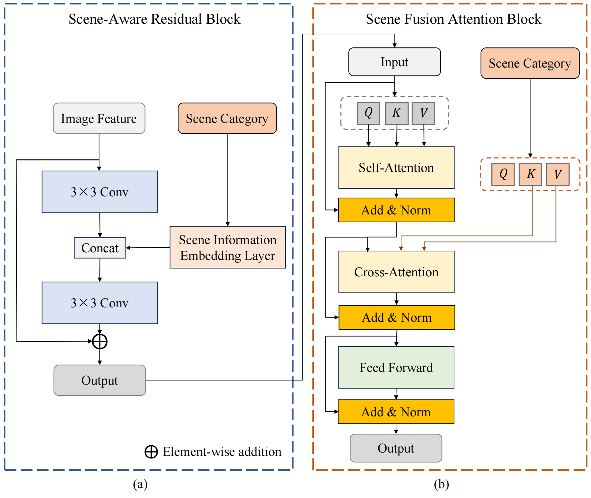
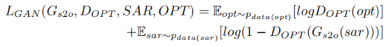
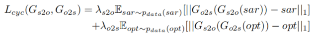
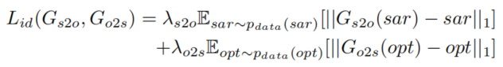
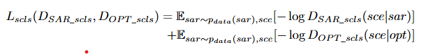
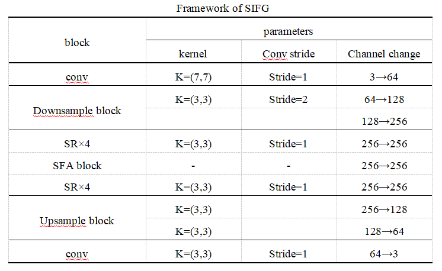
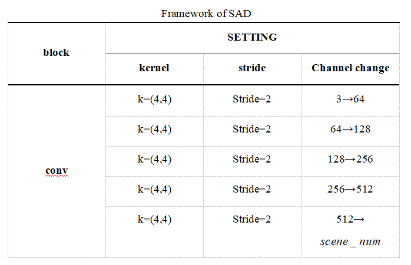

# ScE-GAN
Here we provide an elaboration on the details within the paper "Scene Embedded Generative Adversarial Networks
for Semi-Supervised SAR-to-Optical Image Translation"(GRSL2024) as well as the implementation details of the code.

## supplement of our paper：
Due to the limitations of the paper's length, here we elaborate on some detailed information within the paper. This mainly includes the detailed information of the overall framework's modules, the detailed definition of the loss function, and the detailed information of the network settings. 

**(1)framework of (a)SR block and (b)SFA block**:

Supplementary to Figure 1 of the paper, the detailed expression of the framework's modules is shown in the following. 
we adopt residual block and Transformer to design two blocks that effectively utilize scene category information, i.e., the scene-aware residual (SR) block and the scene fusion attention (SFA) block.The framework of them is shown in folowing Figure (a) and (b).
By substituting the intermediate layer of CycleGAN’s generator with the configuration of SR × 4 + SF A × 1 + SR × 4, we derive the scene information fusion generator (SIFG) inour design.

**(2)detials of loss function**:

Adversarial Loss:The adversarial loss is necessary for GAN training, and we apply the adversarial loss to two translation mappings. For the translation mapping function $G_{s2o}:SAR\rightarrow OPT$ and its discriminator $D_{OPT}$, the objective function of the mapping can be expressed as follows:

where $SAR$ denotes the SAR image, $OPT$ describes the optical image, $G_{s2o}$ represents the generator that produces the optical image from the SAR image, $D_{OPT}$ denotes the discriminator of the optical image, $G_{s2o}$ tries to translate the SAR image to the optical image, and $D_{OPT}$ is used to distinguish the translation result from the real image. We introduce a similar adversarial loss for the mapping function $G_{o2s}:OPT \rightarrow SAR$, i.e., $L_{GAN}(G_{o2s},D_{SAR},OPT,SAR)$.

Cycle-Consistency Loss:Cycle-consistency loss is an important loss in the unpaired I2IT task, which guides the network training by minimizing the $L1$ loss of the image before and after an image undergoing a transformation cycle ($sar\rightarrow G_{s2o}(sar))\rightarrow G_{o2s}(G_{s2o}(sar))\approx sar$), the cycle-consistency is usually denoted as:

where $\lambda_{s2o}$ and $\lambda_{o2s}$ denote the loss weights of the two cycle processes.

Identity Loss:The identity loss can stabilize the overall training and help the network learn the correct results~\cite{ref22}. The identity loss function is expressed as follows:

Scene Loss:The scene loss discriminates the scene information of the images, helping the network generate results that more consistent with the original scene. It guides the network training by calculating the cross-entropy loss function, which is formulated as follows:

where $D_{SAR\_cls}$ and $D_{OPT\_cls}$ represent the scene discriminators for SAR image and optical image, respectively. $sce$ represents the real scene information of the image. ${D_{SAR\_cls}}(sce|sar)$ and ${D_{OPT\_cls}}(sce|opt)$ separately represent the classification probability distribution results of the optical and SAR scene discriminators for the input image.

**(3)structure of SIFG and SAD block**:

detials of SIFG block as follow:

detials of SAD block as follow:

## Implementation details of the code：

**Installation**
please 

